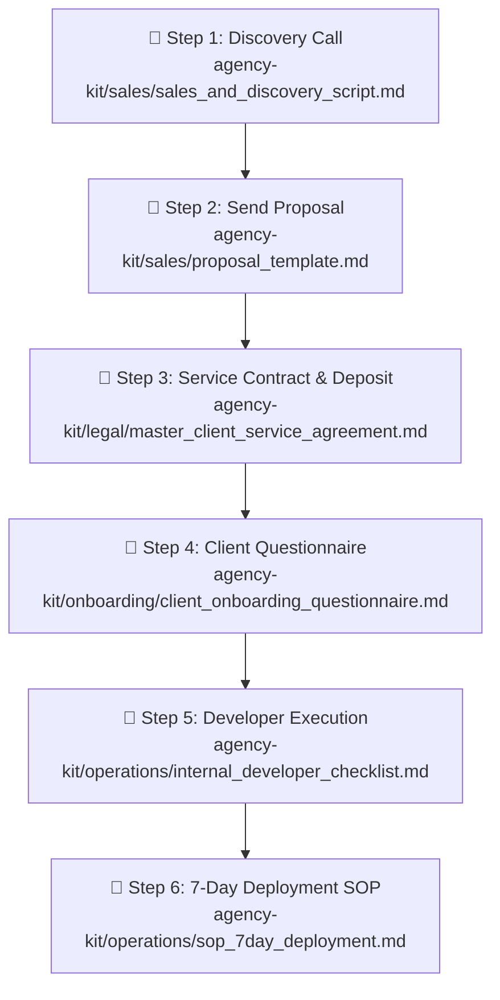

# NativeBooking Agency — Document Flow Map & Step-by-Step Sequence

This document maps out the **exact document sequence** to follow for every client deal, from initial sales contact to production launch.

---

## Visual Document Flow Diagram

---

## Step-by-Step Action Plan

### 📍 STEP 1: Discovery Call
* **File to Open:** `agency-kit/sales/sales_and_discovery_script.md`
* **When:** First meeting with client prospect.
* **Goal:** Diagnose pain points, demo matching blueprint live (`tattoo`, `dental`, `academic`, or `contractor`), qualify budget.

---

### 📍 STEP 2: Proposal Submission
* **File to Open:** `agency-kit/sales/proposal_template.md`
* **When:** Within 2 hours after the discovery call.
* **Goal:** Present formal Tier 1 ($950 setup / $49 mo) vs. Tier 2 ($2,500 setup / $149 mo) options.

---

### 📍 STEP 3: Contract Signing & 50% Upfront Deposit
* **File to Open:** `agency-kit/legal/master_client_service_agreement.md`
* **When:** Immediately upon client accepting proposal.
* **Goal:** Send e-sign contract (DocuSign/PandaDoc) with 50% deposit invoice ($475 for Tier 1 / $1,250 for Tier 2).

---

### 📍 STEP 4: Client Onboarding Intake
* **File to Open:** `agency-kit/onboarding/client_onboarding_questionnaire.md`
* **When:** **ONLY AFTER 50% deposit hits your bank account.**
* **Goal:** Collect client logo files, HEX brand colors, service matrix, staff roster, and domain CNAME.

---

### 📍 STEP 5: Internal Developer Build Execution
* **File to Open:** `agency-kit/operations/internal_developer_checklist.md`
* **When:** Day 1 to Day 5 of the 7-day build.
* **Goal:** Fork blueprint repo into private client repo, configure `businessConfig.ts`, update CSS brand variables, deploy client Firebase project.

---

### 📍 STEP 6: Production Launch & SOP Handover
* **File to Open:** `agency-kit/operations/sop_7day_deployment.md`
* **When:** Day 6 to Day 7.
* **Goal:** Deploy to Vercel custom domain (`booking.clientdomain.com`), conduct 20-min client Admin training, collect remaining 50% balance, and start monthly retainer billing.
