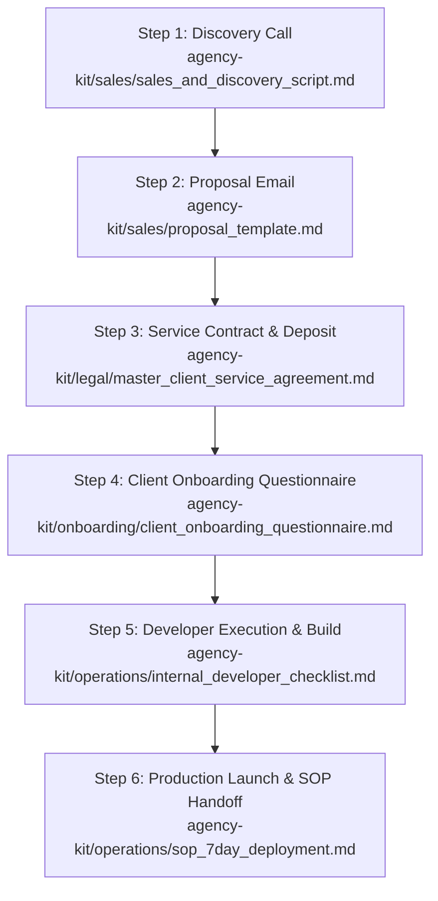

# NativeBooking Agency Master Operations Manual & Step-by-Step Sequence

This document provides the **Master Execution Map** for running a client project from initial discovery call to live deployment and recurring retainer billing.

---

## 1. Standard Recommended Pricing Matrix

Use these standard prices when replacing placeholders like `${{TIER_1_SETUP_PRICE}}` in proposals and contracts:

| Package | One-Time Setup Fee | 50% Upfront Deposit | Monthly Retainer | Best Suited For |
| :--- | :--- | :--- | :--- | :--- |
| **Tier 1: Essential** (Vite SPA) | **$950** | **$475** | **$49 / mo** | Solo artists, small studios, local contractors |
| **Tier 2: Premium Growth** (Next.js) | **$2,500** | **$1,250** | **$149 / mo** | Multi-doctor clinics, academies, high-volume crews |
| **Add-On: Native Mobile App** | **+$950** | **+$475** | **+$30 / mo** | iOS / Android Store Capacitor deployment |

---

## 2. Step-by-Step Document Sequence Map

Follow this exact order of documents for every client deal:

---

## 3. Detailed Document Flow & Actions

### 📍 STEP 1: Discovery Call & Demo
* **File to use:** `agency-kit/sales/sales_and_discovery_script.md`
* **Action:** Run 15-minute call. Show live matching blueprint (`tattoo`, `dental`, `academic`, or `contractor`). Qualify budget.

### 📍 STEP 2: Send Proposal
* **File to use:** `agency-kit/sales/proposal_template.md`
* **Action:** Fill in prices (Tier 1: $950 setup / $49 mo OR Tier 2: $2,500 setup / $149 mo). Send proposal within 2 hours of call.

### 📍 STEP 3: Contract Signing & 50% Deposit
* **File to use:** `agency-kit/legal/master_client_service_agreement.md`
* **Action:** Send contract via DocuSign / HelloSign along with Stripe invoice for 50% deposit ($475 for Tier 1 or $1,250 for Tier 2).

### 📍 STEP 4: Send Onboarding Questionnaire
* **File to use:** `agency-kit/onboarding/client_onboarding_questionnaire.md`
* **Action:** **Send ONLY AFTER deposit is paid.** Client provides logo, HEX brand colors, service pricing matrix, and domain CNAME.

### 📍 STEP 5: Technical Build & Developer Checklist
* **File to use:** `agency-kit/operations/internal_developer_checklist.md`
* **Action:** Fork blueprint branch into private client repo. Configure `businessConfig.ts`, update CSS brand variables, deploy client Firebase project.

### 📍 STEP 6: Production Deployment & Handoff
* **File to use:** `agency-kit/operations/sop_7day_deployment.md`
* **Action:** Deploy to Vercel custom domain (`booking.clientdomain.com`), conduct 20-minute client Admin training, collect final 50% balance, and activate monthly retainer subscription billing.
